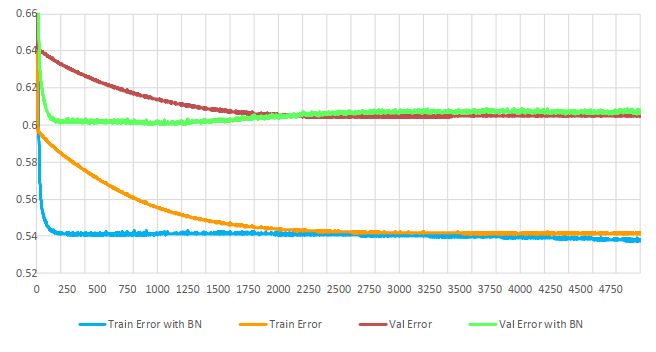

# Experiments with Neural Network and Movie Rating Prediction 

This includes two projects:

## 1. Experiments with model structures

+ Self-implement Neural Network and some advanced learning techniques: drop_out, batch_norm, weight_decay
+ Run experiments with [MovieLen](https://grouplens.org/datasets/movielens/100k/) and [HecLen](https://grouplens.org/datasets/hetrec-2011/) dataset
+ Detail [here](model_struct_exp)

## 2. Using user information to improve results of predicting movie rating

+ Comparing models with and without user information
+ Comparing how to add user information to models: stacking inputs or embedding
+ Detail [here](add_userinfo_exp)

