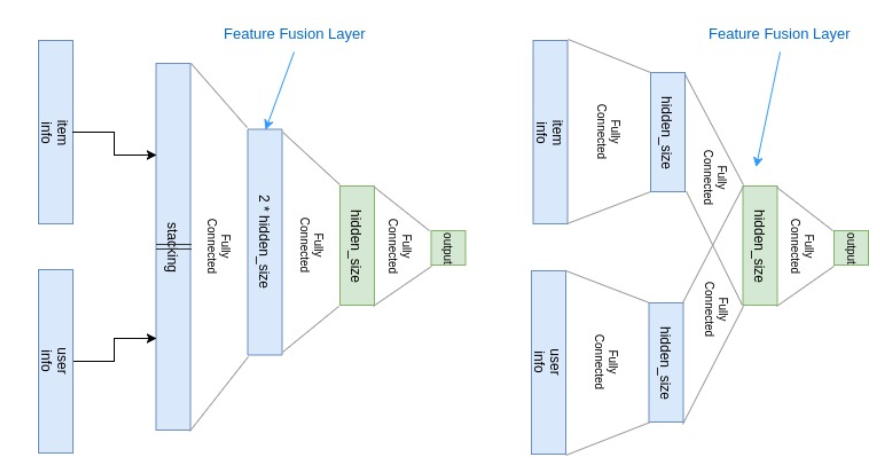
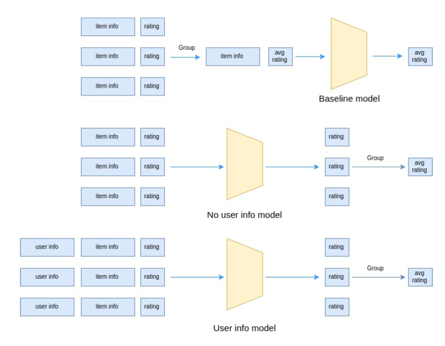
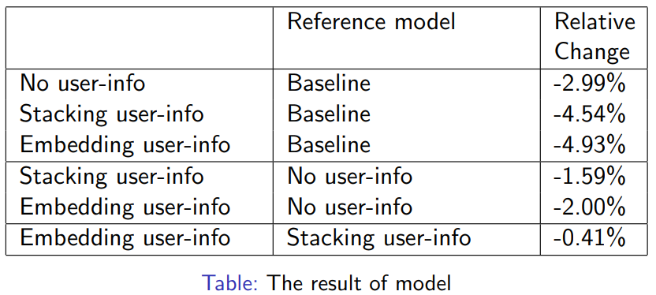

# Improving the result of predicting movie rating by user information

In this project

+ Self-implement Neural Network and some advanced learning techniques: drop_out, batch_norm
+ Run experiments with [MovieLen](https://grouplens.org/datasets/movielens/100k/) and [HecLen](https://grouplens.org/datasets/hetrec-2011/) dataset

## I. Prequitesites

- Anaconda 2.x is required. Install numpy, pandas, seaborn, matplotlib
- Pytorch

## II. Model structure

1. Baseline - Linear Regression
2. Neural Network without user information
3. Add user information to Neural Network by stacking with input
4. Add user information to Neural Netowork by embedding

## III. Experiments

## IV. Results

RMSE of models:
+ Baseline: 0.6170
+ No user-info neural network: 0.5986
+ Stacking: 0.5980
+ Embedding: 0.5866

